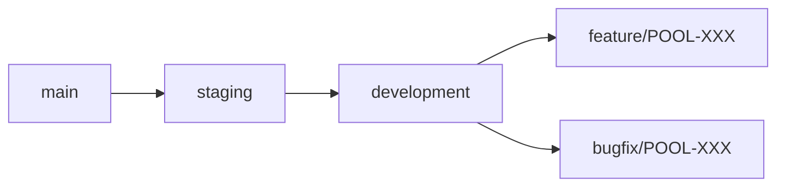

# Splashworks Pool Service BI Visualizer

AI-powered Business Intelligence Platform for Pool Service Management Companies

[](https://github.com/your-org/pool-service-bi/actions)
[](https://www.typescriptlang.org/)
[](https://reactjs.org/)
[](https://tailwindcss.com/)

## 🎯 Overview

The Splashworks Pool Service BI Visualizer is a specialized business intelligence platform designed specifically for pool service management companies. It combines AI-powered analytics with industry-specific insights to help pool service businesses optimize operations, improve customer retention, and increase profitability.

## ✨ Features

### 🏊‍♂️ Pool Service Analytics
- **Customer Retention**: Track retention rates, lifetime value, and churn prediction
- **Route Optimization**: Analyze technician productivity and optimize service routes
- **Revenue Insights**: Monitor financial performance and identify growth opportunities
- **Equipment Tracking**: Manage maintenance schedules and chemical usage optimization

### 🤖 AI-Powered Intelligence
- **Natural Language Queries**: Ask questions about your data in plain English
- **Automated Insights**: AI-generated business recommendations and trend analysis
- **Smart Dashboards**: Intelligent dashboard creation based on your data patterns
- **Predictive Analytics**: Forecast seasonal trends and business opportunities

### 📊 Data Visualization
- **Interactive Charts**: Beautiful, responsive charts built with ECharts
- **Custom Dashboards**: Create executive dashboards tailored to stakeholder needs
- **Mobile-First Design**: Access insights on any device, optimized for field technicians
- **Export Capabilities**: Generate reports and export data for further analysis

### 🗄️ Database Integration
- **SQLite Support**: Upload and analyze AQPS.db, JOMO.sqlite, and custom databases
- **Schema Analysis**: Automatic detection of 37+ pool service data tables
- **Performance Optimization**: Efficient querying of large datasets (50MB+ databases)
- **Data Security**: Local processing ensures your data never leaves your environment

## 🚀 Quick Start

### Prerequisites

- **Node.js** 18+ ([Download](https://nodejs.org/))
- **npm** 9+ (included with Node.js)
- **Git** for version control
- **OpenAI API Key** (optional, for AI features)

### Installation

```bash
# Clone the repository
git clone https://github.com/your-org/pool-service-bi-dashboard.git
cd pool-service-bi-dashboard

# Install dependencies
npm install

# Start development server
npm run dev
```

🌐 Open [http://localhost:5173](http://localhost:5173) to view the dashboard.

### First Steps

1. **📁 Upload Database**: Start by uploading your SQLite database (AQPS.db, JOMO.sqlite, etc.)
2. **🔑 Configure API**: Add your OpenAI API key in Settings for AI-powered features
3. **🔍 Explore Data**: Use the Database Explorer to understand your data structure
4. **💡 Generate Insights**: Let AI analyze your data and provide business recommendations
5. **📈 Create Dashboards**: Build custom executive dashboards for different stakeholders

## 🏗️ Development & Change Control

### 🌿 Branching Strategy



- **`main`**: Production-ready code, protected branch
- **`staging`**: Pre-production testing and UAT
- **`development`**: Integration branch for feature testing
- **`feature/*`**: Individual feature development branches

### 📋 Change Control Process

All changes must follow our [Change Control Guidelines](.github/CHANGE_CONTROL.md):

1. **📝 Create Feature Branch**: Start from `development` branch
2. **💻 Develop & Test**: Implement changes with proper testing
3. **🔍 Code Review**: Submit PR with comprehensive review checklist
4. **✅ Quality Gates**: Pass automated CI/CD checks
5. **🚀 Deploy**: Merge through staging to production

### 🛠️ Development Commands

```bash
# Development server with hot reload
npm run dev

# Production build and optimization  
npm run build

# Run test suite with coverage
npm test

# Code quality checks
npm run lint

# Type checking
npm run type-check

# Format code
npm run format
```

## 🧪 Testing & Quality

### Automated Testing
- **Unit Tests**: Jest + React Testing Library
- **Integration Tests**: Database operations and API interactions
- **E2E Testing**: Cypress for complete user workflows
- **Performance Tests**: Load testing with pool service data volumes

### Code Quality Standards
- **TypeScript**: Strict type checking and industry-specific type definitions
- **ESLint**: Pool service business logic patterns and best practices
- **Prettier**: Consistent code formatting across the team
- **Husky**: Pre-commit hooks for quality enforcement

### Coverage Requirements
- **Unit Tests**: >80% code coverage required
- **Business Logic**: 100% coverage for pool service calculations
- **Critical Paths**: Database operations and AI integrations fully tested

## � Pool Service Industry Features

### Customer Management
```typescript
interface CustomerAnalytics {
  retentionRate: number;
  lifetimeValue: number;
  serviceFrequency: 'weekly' | 'bi-weekly' | 'monthly';
  churnRisk: 'low' | 'medium' | 'high';
  geographicCluster: string;
}
```

### Route Optimization
- **Technician Productivity**: Service completion rates, travel time analysis
- **Geographic Efficiency**: Optimize routes by service area and customer density  
- **Seasonal Planning**: Adjust routing for peak and off-season demands
- **Cost Analysis**: Fuel costs, labor efficiency, and profit optimization

### Financial Analytics
- **Revenue Trends**: Monthly, seasonal, and yearly revenue analysis
- **Profit Margins**: Service-level profitability and cost optimization
- **Growth Opportunities**: Identify high-value customer segments
- **Seasonal Patterns**: Pool maintenance cycles and business forecasting

## 🔒 Security & Compliance

### Data Protection
- **Local Processing**: All data analysis happens locally in your browser
- **No Data Transmission**: Database contents never leave your environment
- **API Key Security**: Secure storage of OpenAI API credentials
- **Input Validation**: SQL injection prevention and data sanitization

### Pool Service Compliance
- **Customer Privacy**: GDPR and CCPA compliant data handling
- **Industry Standards**: Pool service industry best practices
- **Audit Trail**: Complete change tracking and user activity logs
- **Data Retention**: Configurable retention policies for customer data

## � Performance & Scalability

### Database Performance
- **Large Dataset Support**: Efficiently handles 50MB+ SQLite databases
- **Query Optimization**: Indexed queries for sub-second response times
- **Memory Management**: Efficient handling of 37+ table schemas
- **Concurrent Operations**: Multiple simultaneous queries and analysis

### User Experience
- **Fast Loading**: <3 second initial load time
- **Responsive Design**: Optimized for desktop, tablet, and mobile
- **Offline Capable**: Core functionality works without internet
- **Progressive Enhancement**: Advanced features activate with API connectivity

## 🤝 Contributing

We welcome contributions from the pool service community! Please see our detailed [Contributing Guidelines](CONTRIBUTING.md) for:

- **Development Setup**: Environment configuration and prerequisites
- **Coding Standards**: TypeScript, React, and pool service domain patterns
- **Testing Requirements**: Unit, integration, and performance testing guidelines
- **Review Process**: Code review and approval workflows
- **Security Guidelines**: Data protection and pool service compliance

### Getting Help

- **📚 Documentation**: Comprehensive guides in `/docs` folder
- **🐛 Bug Reports**: Use GitHub Issues with pool service context
- **💡 Feature Requests**: Suggest improvements for pool service workflows
- **💬 Discussions**: Join conversations about pool service analytics

## 🎯 Roadmap

### Upcoming Features (Q4 2024)
- [ ] **Mobile App**: Native iOS/Android apps for field technicians
- [ ] **Advanced AI**: GPT-4 powered predictive maintenance recommendations
- [ ] **Integration APIs**: Connect with popular pool service management software
- [ ] **Multi-tenancy**: Support for franchise and multi-location businesses

### Future Enhancements (2025)
- [ ] **IoT Integration**: Connect with pool monitoring sensors and equipment
- [ ] **Customer Portal**: Self-service portal for pool service customers  
- [ ] **Advanced Reporting**: Automated executive reports and business intelligence
- [ ] **Machine Learning**: Predictive models for equipment failure and optimization

## 📄 License

This project is licensed under the MIT License - see the [LICENSE](LICENSE) file for details.

## 🏆 Acknowledgments

- **Pool Service Industry**: For domain expertise and business requirements
- **Open Source Community**: For the amazing tools and libraries that make this possible
- **Contributors**: Everyone who helps improve pool service management through better analytics

---

**Ready to revolutionize your pool service business with AI-powered analytics?**

🚀 **[Get Started Now](http://localhost:5173)** • 📚 **[Read the Docs](./docs/)** • 🤝 **[Contribute](CONTRIBUTING.md)**

## 📱 Usage Examples

### Natural Language Queries
- *"What are our top 10 customers by revenue this year?"*
- *"Show me technician productivity metrics for this month"*
- *"Which routes have the highest skip rates?"*
- *"What's our customer retention rate by city?"*

### Business Scenarios
- **Executive Reporting**: Monthly performance dashboards
- **Route Optimization**: Identify efficiency improvements
- **Customer Analysis**: Target high-value customer segments
- **Operational Planning**: Optimize technician schedules and routes

## 🏗️ Architecture

### Tech Stack
- **Frontend**: React 18 + TypeScript
- **Styling**: Tailwind CSS with pool service theme
- **Database**: SQLite with SQL.js (client-side processing)
- **AI Integration**: OpenAI API for natural language processing
- **Charts**: ECharts for interactive visualizations
- **Build Tool**: Vite for fast development

### Pool Service Schema
The application works with 37 interconnected tables including:
- **Core Entities**: Customer, ServiceLocation, Pool, Account (Technicians)
- **Operations**: RouteStop, ServiceStopEntry, WorkOrder, Equipment
- **Financial**: Invoice, Payment, Product, Pricing
- **Analytics**: Service history, chemical readings, route data

## 📊 Sample Data

The project includes test databases:
- **AQPS.db** (54MB): Production-like data with 1,874 customers and 18,349 route stops
- **JOMO.sqlite** (140MB): Large dataset for performance testing
- **Skimmer-schema.sql**: Complete database schema reference

## 🧪 Testing

Comprehensive testing plan included:
- **Performance Testing**: Large database handling (140MB+)
- **AI Integration**: Natural language query validation  
- **Business Logic**: Pool service specific scenarios
- **User Experience**: Mobile-responsive design for field technicians

```bash
# Run development server
npm run dev

# Build for production
npm run build

# Run linting
npm run lint
```

## 🎨 Pool Service Theme

The application features a custom design system optimized for pool service companies:
- **Pool Blue Palette**: Professional blue tones
- **Service-Focused UI**: Technician-friendly mobile interface
- **Business Dashboards**: Executive-level reporting layouts
- **Interactive Charts**: Revenue, efficiency, and customer analytics

## 📈 Business Metrics Tracked

### Financial Performance
- Monthly revenue trends and forecasting
- Customer lifetime value analysis
- Service pricing optimization
- Invoice and payment tracking

### Operational Efficiency
- Technician productivity and utilization
- Route optimization and travel time
- Service completion rates
- Equipment and chemical usage

### Customer Intelligence
- Retention and churn analysis
- Service frequency patterns
- Geographic customer distribution
- Customer satisfaction trends

## 🔧 Development

### Project Structure
```
src/
├── components/          # React components
│   ├── analytics/      # Business intelligence components
│   ├── dashboard/      # Dashboard and chart components
│   ├── pool-service/   # Pool-specific components
│   └── common/         # Shared UI components
├── hooks/              # Custom React hooks
├── types/              # TypeScript type definitions
├── utils/              # Utility functions
└── styles/             # Tailwind CSS styles
```

### Key Components
- **PoolServiceDashboard**: Executive overview dashboard
- **RouteAnalytics**: Route optimization and technician metrics
- **CustomerAnalytics**: Customer retention and value analysis
- **AIQueryInterface**: Natural language business queries
- **FinancialReporting**: Revenue and profitability analysis

## 🌟 Features Roadmap

- [ ] **Mobile App**: Native iOS/Android app for technicians
- [ ] **Real-time Sync**: Live data synchronization
- [ ] **Advanced AI**: Predictive analytics and forecasting
- [ ] **Integration**: QuickBooks and other business software
- [ ] **Mapping**: Route visualization and GPS integration

## 📄 License

MIT License - See [LICENSE](LICENSE) file for details.

## 🤝 Contributing

This is a specialized tool for pool service companies. For feature requests or issues related to pool service business logic, please create an issue with detailed business context.

## 🏊‍♂️ Pool Service Industry Focus

This application is specifically designed for:
- **Residential Pool Service Companies**
- **Commercial Pool Maintenance Providers** 
- **Pool Equipment Installation Services**
- **Chemical Treatment Specialists**
- **Multi-location Pool Service Franchises**

---

**Built for Pool Service Professionals** | **Powered by AI Analytics** | **Optimized for Business Growth**