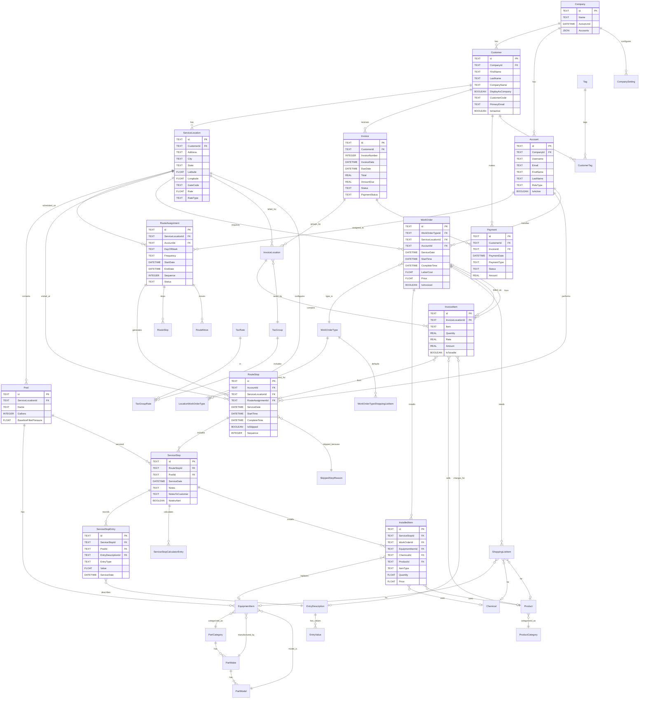
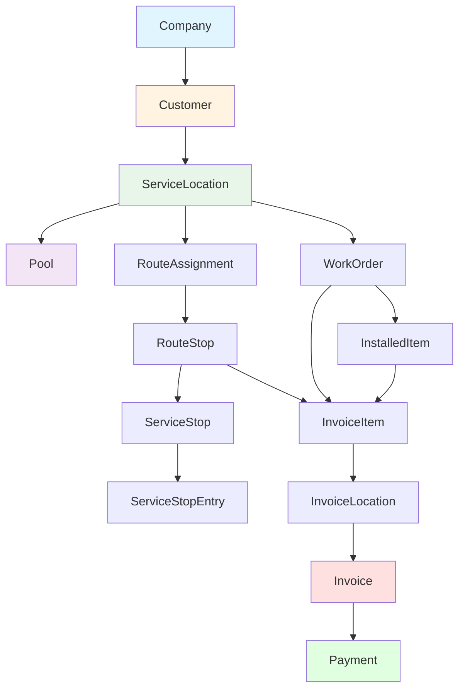
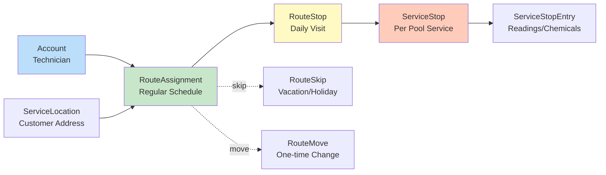
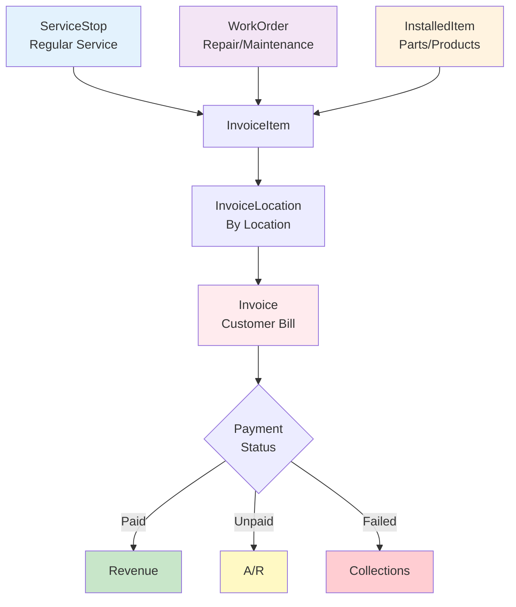
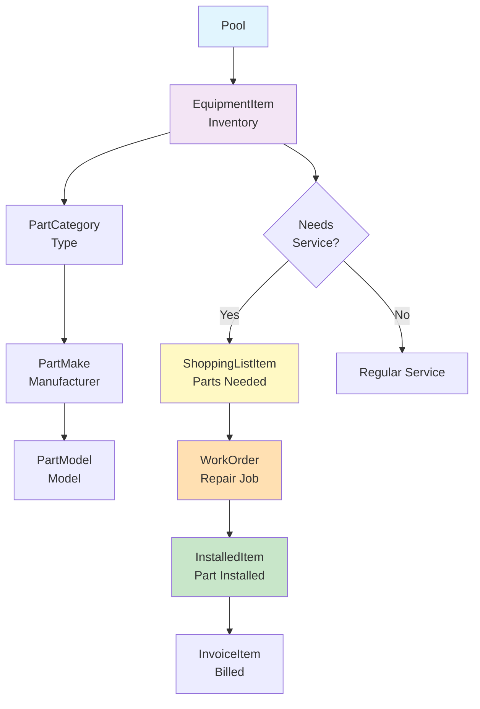

# Skimmer Pool Service Database - Entity Relationship Diagram

**Version**: 1.0  
**Last Updated**: October 26, 2025  
**Database Type**: SQLite

---

## Full Database ERD



---

## Core Business Flow Diagram



---

## Scheduling & Routing Flow



---

## Revenue Generation Flow



---

## Equipment Management Flow



---

## Key Relationship Patterns

### 1. Customer Journey
```
Company → Customer → ServiceLocation → Pool
                                    → RouteAssignment
                                    → Invoice
```

### 2. Service Execution
```
Account (Tech) + RouteAssignment → RouteStop → ServiceStop → ServiceStopEntry
```

### 3. Work Order Lifecycle
```
ServiceLocation → WorkOrder → ShoppingListItem → InstalledItem → InvoiceItem
```

### 4. Revenue Chain
```
ServiceStop/WorkOrder → InvoiceItem → InvoiceLocation → Invoice → Payment
```

### 5. Equipment Tracking
```
Pool → EquipmentItem → ShoppingListItem → InstalledItem
    ↓                       ↓                  ↓
PartCategory            WorkOrder         InvoiceItem
```

---

## Table Relationship Density

### High Connectivity (Hub Tables)
- **ServiceLocation**: 7 direct relationships
- **Invoice**: 5 direct relationships  
- **WorkOrder**: 6 direct relationships
- **Pool**: 4 direct relationships

### Junction Tables (Many-to-Many)
- **CustomerTag**: Customer ↔ Tag
- **TaxGroupRate**: TaxGroup ↔ TaxRate
- **InvoiceLocation**: Invoice ↔ ServiceLocation

### Reference Tables (Lookup)
- PartCategory, PartMake, PartModel
- WorkOrderType, EntryDescription
- Chemical, Product, ProductCategory
- Tag, TaxGroup, TaxRate
- SkippedStopReason

---

## Critical Join Paths

### Path 1: Customer to Revenue
```sql
Customer 
  → ServiceLocation 
  → InvoiceLocation 
  → Invoice 
  → Payment
```

### Path 2: Technician Performance
```sql
Account 
  → RouteStop 
  → ServiceStop 
  → ServiceStopEntry
```

### Path 3: Equipment to Billing
```sql
Pool 
  → EquipmentItem 
  → InstalledItem 
  → InvoiceItem 
  → Invoice
```

### Path 4: Service to Invoice
```sql
RouteStop 
  → ServiceStop 
  → ServiceStopEntry 
  → InvoiceItem 
  → Invoice
```

### Path 5: Work Order to Revenue
```sql
WorkOrder 
  → InstalledItem 
  → InvoiceItem 
  → Invoice 
  → Payment
```

---

## Cardinality Summary

| Relationship Type | Count | Examples |
|------------------|-------|----------|
| One-to-Many | 60+ | Customer → ServiceLocation, Pool → EquipmentItem |
| Many-to-One | 60+ | RouteStop → Account, Invoice → Customer |
| Many-to-Many | 3 | Customer ↔ Tag, TaxGroup ↔ TaxRate |
| One-to-One | 2 | RouteMove → RouteStop, ShoppingListItem → InstalledItem |

---

## Foreign Key Enforcement

**Note**: SQLite foreign keys are NOT enforced at the database level in this schema. Application-level enforcement is critical.

### Required Foreign Keys (NOT NULL)
- All `CompanyId` columns (multi-tenancy)
- `Customer.CompanyId`
- `ServiceLocation.CustomerId`
- `Pool.ServiceLocationId`
- `RouteStop.ServiceLocationId`, `AccountId`

### Optional Foreign Keys (Nullable)
- `RouteStop.SkippedStopReasonId` (only if skipped)
- `InvoiceItem.WorkOrderId` (only for work order items)
- `InstalledItem.EquipmentItemId` (only for equipment)

---

## Database Design Patterns

### 1. Soft Deletes
Many tables use `Deleted` or `SoftDeleted` boolean flags:
- Preserves historical data
- Maintains referential integrity
- Enables audit trails

### 2. Denormalization
JSON fields cache related data for performance:
- `Customer.ServiceLocations`
- `ServiceLocation.Pools`
- `Pool.EquipmentItems`
- `RouteStop.ServiceStops`

### 3. Polymorphic Relationships
`InvoiceItem` can link to multiple source types:
- `RouteStopId` (regular service)
- `WorkOrderId` (repair work)
- `ProductId` (product sales)
- `EntryDescriptionId` (chemical/reading charges)

### 4. Audit Fields
Standard on all tables:
- `CreatedAt` - When record was created
- `UpdatedAt` - When record was last modified
- `Version` - Optimistic locking (BLOB)

---

## Query Optimization Hints

### Indexes Recommended
```sql
-- Critical join columns
CREATE INDEX idx_customer_companyid ON Customer(CompanyId);
CREATE INDEX idx_servicelocation_customerid ON ServiceLocation(CustomerId);
CREATE INDEX idx_routestop_accountid ON RouteStop(AccountId);
CREATE INDEX idx_routestop_servicedate ON RouteStop(ServiceDate);
CREATE INDEX idx_invoice_customerid ON Invoice(CustomerId);
CREATE INDEX idx_invoice_invoicedate ON Invoice(InvoiceDate);

-- Composite indexes for common queries
CREATE INDEX idx_routestop_date_account ON RouteStop(ServiceDate, AccountId);
CREATE INDEX idx_servicestopentry_pool_date ON ServiceStopEntry(PoolId, ServiceDate);
```

### Multi-Table Query Tips
1. **Always filter by CompanyId first**
2. **Use explicit JOIN syntax** (not implicit WHERE joins)
3. **Join in order of relationship** (Company → Customer → Location → Pool)
4. **Limit JSON field access** (use normalized tables for queries)
5. **Use CTEs for complex multi-step queries**

---

**End of ERD Documentation**
