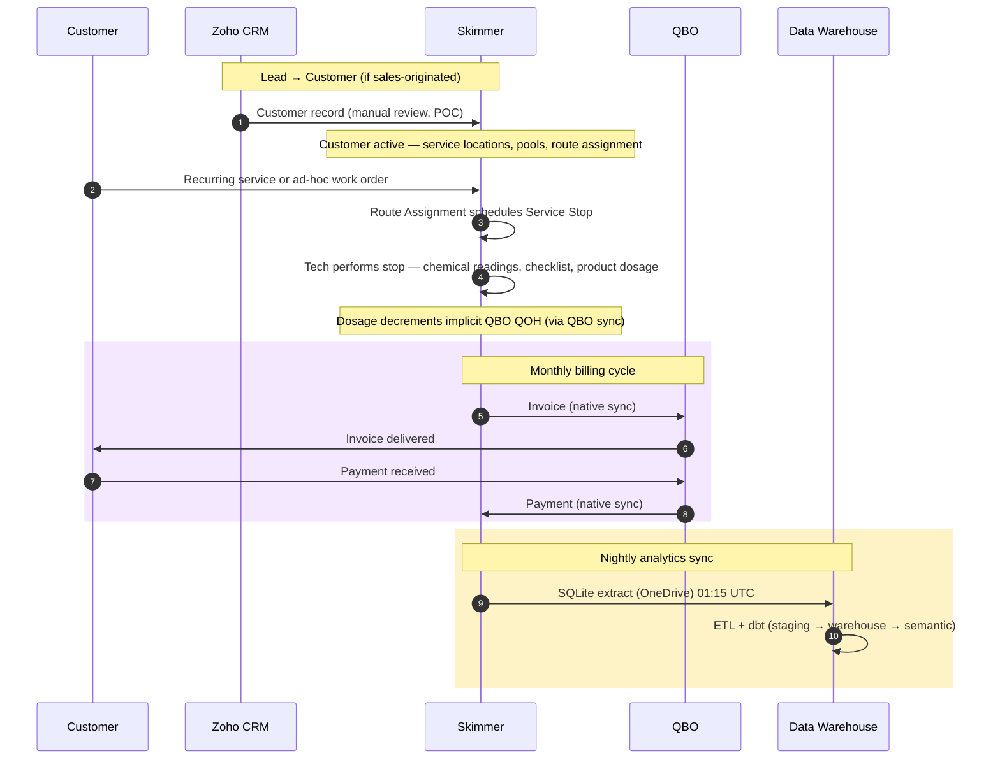
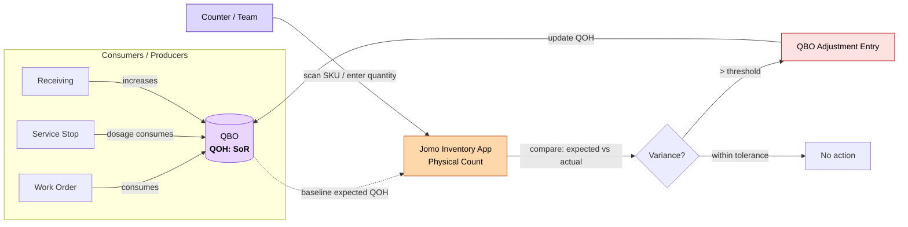
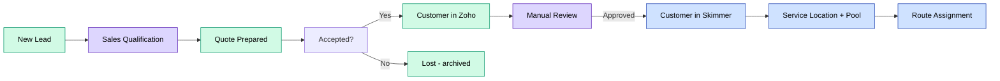
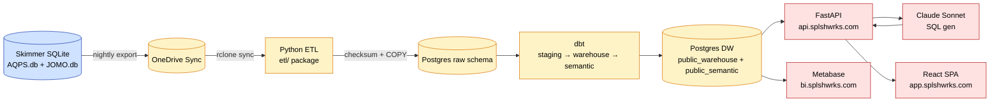

# Data Flow Diagrams

**Purpose:** How data moves between systems for key Splashworks business processes.

**Last updated:** 2026-04-20

---

## 1. Service-to-Cash

Core revenue cycle. Customer acquisition through payment receipt, with warehouse consumption for analytics.

**Key handoffs:**

| # | Step | From | To | Failure mode |
|---|---|---|---|---|
| 1 | Lead conversion | Zoho | Skimmer | Manual review backlog |
| 5 | Dosage → QOH | Skimmer | QBO | Silent drift if sync fails |
| 7 | Invoice sync | Skimmer | QBO | QBO returns error, Skimmer retries |
| 10 | Payment sync back | QBO | Skimmer | Customer shows unpaid in Skimmer |
| 11 | Nightly extract | Skimmer (SQLite) | Warehouse | Schema drift (observed 2026-04-14) |

---

## 2. Inventory Reconciliation

Physical count via inventory-app reconciles against QBO (QOH system of record).

**Current gap:** Skimmer's work-order commitments don't currently check QBO QOH — tech can commit stock that doesn't exist. Reconciliation catches this after the fact, not before.

---

## 3. Lead-to-Customer

Sales intake through operational activation.

---

## 4. Skimmer → Warehouse → AI Query

Nightly analytics path.

---

## Related

- [Entity Map](entity-map.md) — the nouns
- [System Landscape](system-landscape.md) — the topology
- [State Diagrams](state-diagrams.md) — the lifecycles
