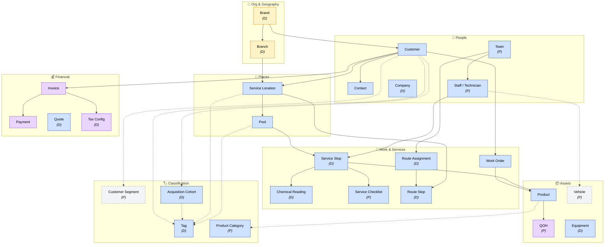

# Enterprise Entity Map

**Purpose:** One-page visual ontology of Splashworks canonical business entities, grouped by domain and color-coded by System of Record.

**Last updated:** 2026-05-23

---

## Legend

**Color — System of Record**

| Swatch | System | Role |
|---|---|---|
| 🟦 Blue | Skimmer | Service operations |
| 🟪 Purple | QBO Advanced | Financial (invoicing, payments, QOH) |
| 🟩 Green | Zoho CRM | Sales / leads |
| 🟨 Yellow | Data Warehouse | Derived / analytics-only (no origin data) |
| ⬜ Gray (dashed) | SoR TBD | Open governance question |

**Status markers**

- *(no marker)* — Finalized glossary entry
- **(D)** — DRAFT, under review
- **(P)** — PROPOSED, not yet drafted

---

## Entity Map

---

## Open System-of-Record questions

| Entity | Candidates | Notes |
|---|---|---|
| **Vehicle** | QBO (fixed asset) / future fleet-mgmt tool / inventory-app (current custodian) | No real IMS today. Inventory-app holds operational data (VIN, plate, lease, division) but isn't authoritative. |
| **Customer Segment** | Zoho (origin at sales) / Skimmer (ops persistence) | Drives pricing and routing — needs one SoR. |
| **Product Category** | per classification-governance standard | Resolved by `standards/classification-governance.md` (in progress). |
| **Tax Configuration** | QBO (assumed) | Confirm during DRAFT finalization. |

---

## Key relationships — in plain English

- A **Brand** (JOMO, Splashworks) groups one or more **Branches** and owns **Customers**.
- A **Branch** is a geographic territory (Jacksonville for JOMO; Spring Hill or Ocala for Splashworks). It contains **Service Locations**. Branch is derived from `billing_zip` + `billing_city`.
- A **Customer** has one or more **Contacts**, **Service Locations**, and **Invoices**.
- A **Service Location** has one or more **Pools**.
- A **Pool** receives **Service Stops**, each of which records **Chemical Readings** and completes a **Service Checklist**.
- A **Service Stop** is performed by one **Staff** member and consumes **Products**.
- **Staff** belong to **Teams**. Teams are assigned to **Route Assignments**, which schedule **Route Stops** at Service Locations.
- **Work Orders** are ad-hoc (not recurring) requests against a Customer; they also consume **Products**.
- **Invoices** receive **Payments** and apply **Tax Configuration**.
- **Products** have a point-in-time **QOH** (stock level, per location).
- **Classification** (Tag, Customer Segment, Product Category, Acquisition Cohort) applies cross-cuttingly — shown as dashed.
- **Acquisition Cohort** is implemented via **Tag** — a customer is "in" a cohort when they carry the cohort's named Tag and match the cohort's computation mode (recent / legacy / route_before_tag).

---

## Related docs

- [System Landscape](system-landscape.md) — systems and data flows (complementary view)
- [enterprise-index.yaml](enterprise-index.yaml) — machine-readable entity manifest
- [README.md](README.md) — EIA overview and contribution guide
