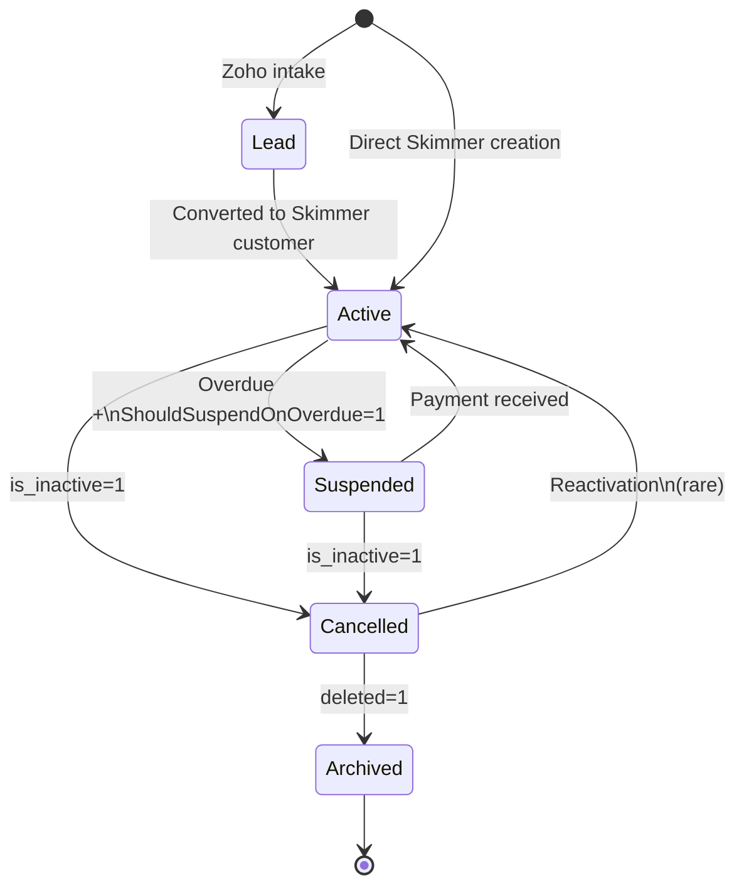
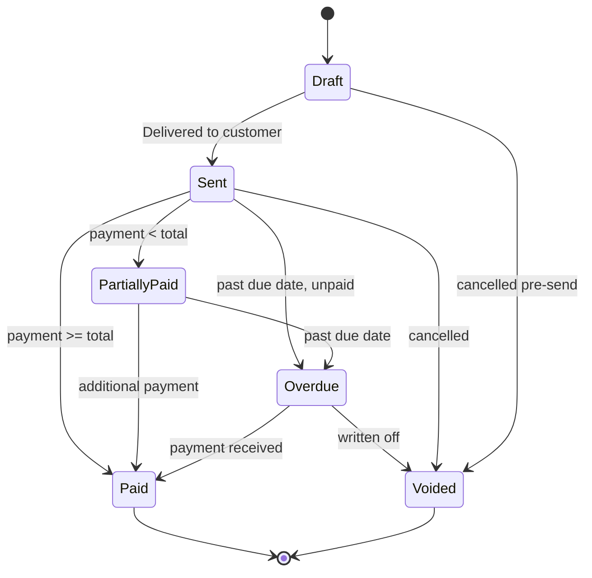
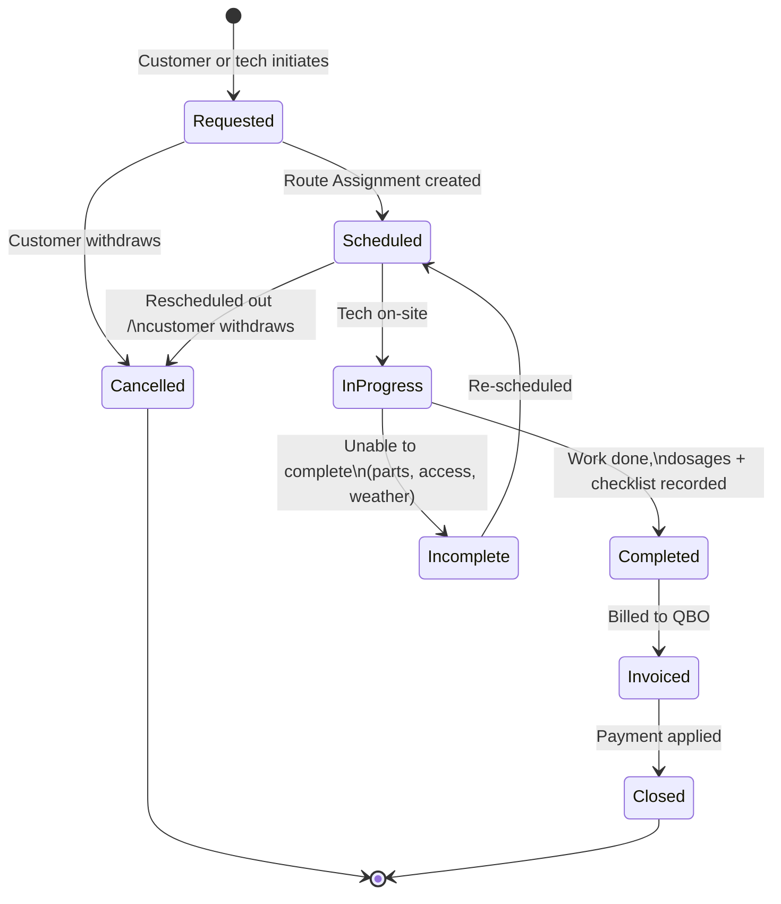
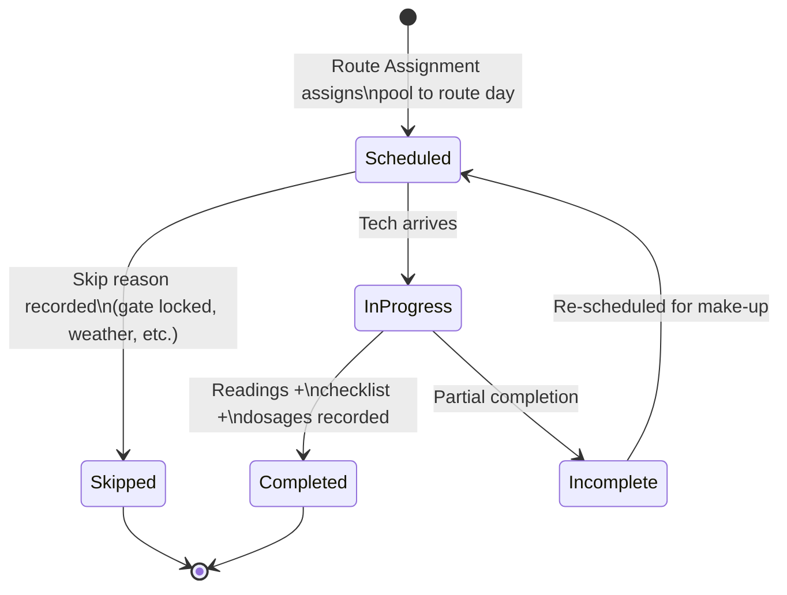
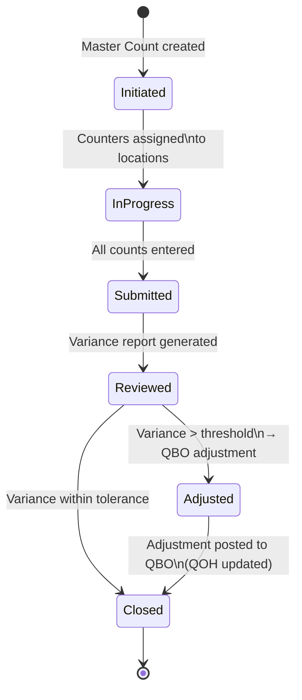

# Entity State Diagrams

**Purpose:** Lifecycle states for key Splashworks business entities. Each state corresponds to a set of flag/field values in the system of record.

**Last updated:** 2026-04-20

---

## 1. Customer Lifecycle

From Zoho lead through Skimmer active → suspended → cancelled → archived.

**Field mapping:**

| State | `is_inactive` | `deleted` | Other |
|---|---|---|---|
| Lead | — | — | In Zoho only |
| Active | 0 | 0 | |
| Suspended | 0 | 0 | Overdue balance + `ShouldSuspendOnOverdue=1` |
| Cancelled | 1 | 0 | `updated_at` = cancellation date |
| Archived | any | 1 | Tombstone |

---

## 2. Invoice Lifecycle

QBO is system of record for invoice state.

---

## 3. Work Order Lifecycle

Ad-hoc repair/maintenance request, separate from recurring Service Stops.

---

## 4. Service Stop Lifecycle

Recurring per-visit record. Different from work order — these are scheduled weekly routes.

**Sentinel:** Skimmer stores non-completion as `service_date = 2010-01-01 12:00:00` — warehouse filters this out when computing "completed stops."

---

## 5. Inventory Count Lifecycle

The physical stocktake process (not an entity, but a governed workflow).

---

## Related

- [Entity Map](entity-map.md) — the nouns
- [Data Flow Diagrams](data-flow-diagrams.md) — how data moves
- [System Landscape](system-landscape.md) — the topology
