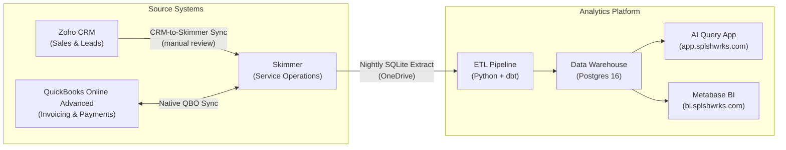

# System Landscape

**Current State: v1.0 -- March 2026**

## Overview

Splashworks operates four integrated systems for pool service management. Skimmer is the operational hub, managing customers, service locations, pools, technician routes, invoices, and payments. The Data Warehouse is the analytical hub, consolidating Skimmer data into a structured Postgres database with dbt-modeled dimensional layers, powering both an AI natural-language query app and Metabase BI dashboards. Zoho CRM handles sales and lead management. QuickBooks Online Advanced handles invoicing and payments with a native bi-directional sync to Skimmer.

## System Landscape Diagram

## Integration Details

| Integration | Direction | Method | Frequency | Status |
|-------------|-----------|--------|-----------|--------|
| Zoho --> Skimmer | One-way (manual review) | REST API sync POC | On-demand | POC |
| QBO <--> Skimmer | Bi-directional | Native Skimmer integration | Real-time | Active |
| Skimmer --> Warehouse | One-way | SQLite extract --> Python ETL --> dbt | Nightly (1:15 AM UTC) | Active |
| Warehouse --> AI Query | Read-only | FastAPI + Claude AI | On-demand | Active |
| Warehouse --> Metabase | Read-only | Direct Postgres connection | On-demand | Active |

## Data Entities by System

| Entity | Zoho CRM | Skimmer | QBO Advanced | Warehouse |
|--------|----------|---------|--------------|-----------|
| Customer | Contact | Customer | Customer | dim_customer, rpt_customer_360 |
| Service Location | Other_Address | ServiceLocation | -- | dim_service_location |
| Pool | Pool_Type field | Pool (Body of Water) | -- | dim_pool |
| Invoice | -- | Invoice | Invoice | fact_invoice |
| Payment | -- | Payment | Payment | fact_payment |
| Technician | -- | Account | Employee | dim_tech |

## Planned Changes

- **QBO Advanced direct warehouse integration** -- Extract financial data independent of Skimmer to capture QBO-native fields and reduce dependency on Skimmer as the sole data source.
- **Zoho CRM full bi-directional sync** -- Pending POC completion. Goal is automated lead-to-customer lifecycle flow between Zoho and Skimmer.
- **Time and attendance integration** -- Homebase or similar platform. Blocked on vendor selection. Would feed labor hours into the warehouse for true cost-of-service analysis.

## Change Log

| Date | Version | Change | Author |
|------|---------|--------|--------|
| 2026-03-14 | v1.0 | Initial system landscape -- 4 systems, 5 integrations | Ross Sivertsen |
